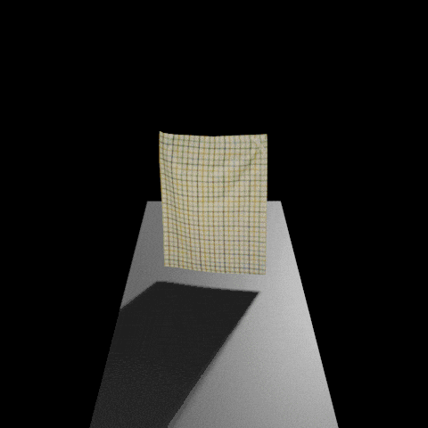

# Benchmarking the Sim-to-Real Gap in Cloth Manipulation
This repository contains the code for the paper "Benchmarking the Sim-to-Real Gap in Cloth Manipulation".

D. Blanco-Mulero, O. Barbany, G. Alcan, A. Colomé, C. Torras and V. Kyrki, "Benchmarking the Sim-to-Real Gap in Cloth Manipulation," in IEEE Robotics and Automation Letters, vol. 9, no. 3, pp. 2981-2988, March 2024, doi: 10.1109/LRA.2024.3360814

[Project Website](https://sites.google.com/view/cloth-sim2real-benchmark) / [Pre-print](https://arxiv.org/abs/2310.09543) / [Published Version](https://ieeexplore.ieee.org/abstract/document/10417136)


# Table of Contents
- 1 [Installation](#installation)
  - 1.1 [Conda and repository setup](#conda-and-repository-setup)
  - 1.2 [Softgym installation](#softgym-installation)
  - 1.3 [SOFA installation](#sofa-installation)
- 2 [Code Usage](#code-usage)
- 3 [Example environments](#example-environments)
- 4 [Citation](#citation)


## Installation
### Conda and repository setup
It is recommended to first set a conda environment with pip and a Python version offering compatibility, e.g., by running:
```
conda env create -f bcm.yml
conda activate bcm
```

Then, clone this repository, start the submodules and install its contents as follows:
```
git clone git@github.com:dblanm/dynamic_dual_manip.git
cd dynamic_dual_manip
git submodule init
git submodule update
/path_to_your_conda_env/bin/pip install -e .
```


### Softgym installation
For setting up the [SoftGym](https://github.com/dblanm/softgym/tree/master) environment follow the instructions on the repository.
If you run into some issues you can double-check [this](https://danieltakeshi.github.io/2021/02/20/softgym/) blog from Daniel Takeshi.

As a note, we have found issues while trying to install PyFlex on graphic cards of the series RTX 3xxx.

Once SoftGym is compiled, it may be useful to set the environment variables once inside the conda environment. To do that, move to the root of the repository, activate the `bcm` environment, and execute:
```
conda env config vars set PYFLEXROOT=${PWD}/deps/softgym/PyFlex
conda env config vars set PYTHONPATH=${PYFLEXROOT}/bindings/build:$PYTHONPATH
conda env config vars set LD_LIBRARY_PATH=${PYFLEXROOT}/external/SDL2-2.0.4/lib/x64:$LD_LIBRARY_PATH
```
Then, reset your environment for the changes to take effect.

You need to install the dependency of softgym for it to run or add the softgym directory to the PYTHONPATH:
```shell
export PYTHONPATH=/path_to_folder/bcm/deps/softgym:$PYTHONPATH
```


### SOFA installation
We provide a Docker file containing the required packages to run SofaPython3 and the bcm package installed onto the docker.
First you need to build the sofa_py3 docker using
```shell
docker build -t sofa_py3 -f sofapy3_Dockerfile .
```
Then you can build the bcm SOFA docker by running
```shell
docker build -t bcm_sofa -f bcm_sp3_Dockerfile .
```

#### SOFA local installation
In case that you want to build SOFA locally, follow the [SOFA](https://www.sofa-framework.org/community/doc/getting-started/build/linux/) installation alongside with
the changes required for the [SofaPython3](https://sofapython3.readthedocs.io/en/latest/menu/Compilation.html) package.

You will need to change in the Cmake the following:
```
Pybind11 - /path_to_anaconda/envs/pytorch3d/share/cmake/pybind11/pybind11Config.cmake
SP3_PYTHON_PACKAGES_LINK_DIRECTORY
SP3_PYTHON_PACKAGES_DIRECTORY
/path_to_anaconda/anaconda3/envs/pytorch3d/lib/python3.9/site-packages/
```

To run SOFA you will need to add the following
```shell
export SOFA_ROOT="${oc.env:HOME}/projects/bcm/deps/sofa/build/install"
export PYTHONPATH=${oc.env:HOME}/bcm/deps/sofa/build/install/plugins/SofaPython3/lib/python3/site-packages:$PYTHONPATH
```

## Code Usage
### Usage Without Docker
If you want to run Bullet or MuJoCo you can do it without the softgym or SOFA docker we provide.
For running SOFA check 

We use hydra to easily switch between environments. 
For example to simply run the dynamic manipulation primitive using MuJoCo you can use
```shell
python -m bcm envs=mujoco3 primitive=dynamic cloth_sample=chequered_rag_0 target=None plot=True
```
This will execute the dynamic primitive and render the environment.

Use the `cloth_sample` argument to set the fitted parameters into the simulator, e.g. `cloth_sample=chequered_rag_0`. If you set `cloth_sample=None` the simulation will run with default parameters that do not correspond to any of the dataset cloths.

You can check the default configuration in the file [`bcm.conf.config.yaml`](./bcm/conf/config.yaml)
The additional arguments are
```
- save_gif=True | False (default)
- envs= bullet  | sofa | softgym | mujoco (default)
- primitive = dynamic | quasi-static
- cloth_sample = None | chequered_rag_0 | cotton_rag_0 | linen_rag_0
- target = None | chequered_rag_# | cotton_rag_# | linen_rag_#
- data_path = Path to the benchmark dataset, e.g. `${oc.env:HOME}/datasets/Benchmarking_cloth`
- --multirun: Used to optimise the parameters of a simulator given a target cloth.
- hydra/sweeper/sampler= gpyopt | cmaes | pymoo | botorch
```

If you want to compare against one of the dataset cloths, set the `target` to the specific cloth. where the number of the cloth type to compare against is selected from 0-2, e.g. `target=linen_rag_2`.

### Run SOFA with Docker
The following steps are to run BCM using the terminal inside the SOFA docker.
First, to run the docker we need to attach the dataset and the BCM repo
```shell
docker run -v ${HOME}/datasets/Benchmarking_cloth/:/builds/datasets/Benchmarking_cloth/ -v ${PWD}:/builds/bcm/ \
-v /tmp/.X11-unix:/tmp/.X11-unix -e DISPLAY=$DISPLAY \
-e QT_X11_NO_MITSHM=1 -w /builds/bcm \
-it bcm_sofa:latest bash
```

Then run the code using the following.
```
python -m bcm envs=sofa primitive=dynamic cloth_sample=chequered_rag_0 target=None data_path=/builds/datasets/Benchmarking_cloth
```


## Example environments
### MuJoCo

### PyBullet

### Sofa

### SoftGym

### Real World Demonstration


## Citation
```
@ARTICLE{blancomulero2023benchmarking,
  author={Blanco-Mulero, David and Barbany, Oriol and Alcan, Gokhan and Colomé, Adrià and Torras, Carme and Kyrki, Ville},
  journal={IEEE Robotics and Automation Letters}, 
  title={Benchmarking the Sim-to-Real Gap in Cloth Manipulation}, 
  year={2024},
  volume={9},
  number={3},
  pages={2981-2988},
  keywords={Manipulator dynamics;Trajectory;Task analysis;Benchmark testing;Fabrics;Dynamics;Engines;Data sets for robot learning;bimanual manipulation;deformable object manipulation},
  doi={10.1109/LRA.2024.3360814}
}
```
